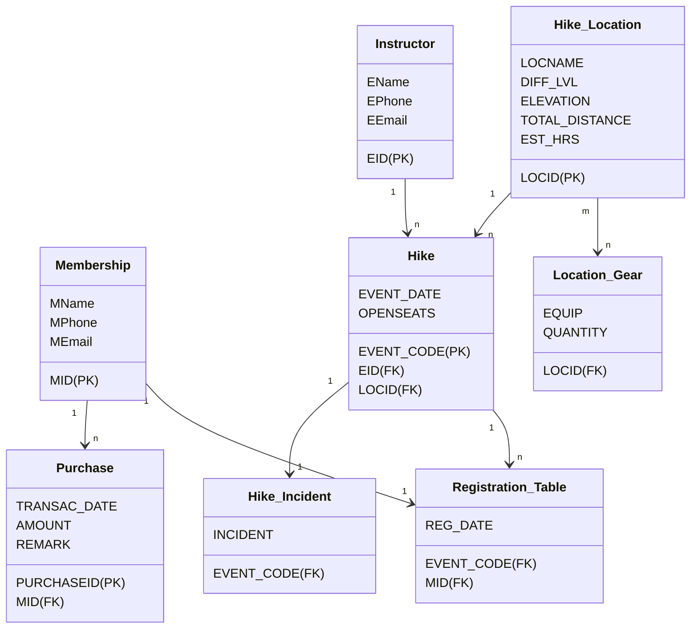

# Up-the-hill Hiking

## Hiking Events Organizer Company

---

### Project Description

This is a company that organizes hiking events with participating members. Customers must purchase a membership in order to participate in hikes. Members are given a membership ID upon  registration, on which records the registration date of the member to keep track of membership renewal.

There are predetermined destinations where hikes could be set up and planned to avoid weather conditions. Each hike must be supervised by an employee of suitable certications and experience. A simple table of the employees' work information is kept for members to see which instructor is assigned.

Scheduled hikes are shown in detail for members to see if they are suitable for the challenge. There are also limited seats for each hike which decrements according to number of registrations in the registration table. For some of the more challenging hikes, additional equipments and payments might be required. The amount of payment varies for different items and occasions, but all payments are recorded with an optional note where the reason of purchase could be recorded.

In case of accidents or events during hikes, such incidents could be recorded for any follow-up or additional inquiries.

+ Hike registration is final, which means that if a member backs out after registering for a hike, the seat remains closed.

---

### Schema Revision



Remarks:

+ The registration table holds all the records of each hike until the event is over.

  + This is in place to ensure that members could only sigh up for one hike at a time.

+ Additional changes could be implemented to catch the tossed data from the registration table when events are over and store all the records in a separate table under the schema.

---

### Data Normalization

Walkthrough of data normalization process:

#### Membership

+ For the entities related to membership, purchases should be isolated from the membership table to satisfy 1NF and to eliminate the chances of having multiple rows of the same membership data.

+ The two tables othewise satifies 2NF, 3NF and BCNF as all non-prime attributes are fully functionally dependent on the keys, and no non-prime attribute implies a key.

<ins>MID</ins> | MFNAME | MLNAME | MPHONE | MEMAIL
---|---|---|---|---

<ins>PURCHASEID</ins> | <ins>MID</ins> | TRANSAC_DATE | AMOUNT | REMARK
---|---|---|---|---

#### Instructor

+ The instructor table is simplistic in nature and satisfies BCNF

<ins>EID</ins> | ENAME | EPHONE | EEMAIL
---|---|---|---

#### Hike_Location

+ Locational gear is separated from the hike locations to satisfy 1NF.

+ The equipment and quantity is fully dependent on the location of the hike.

+ The locational information of each destination is groupe and identified by a unique key, therefore is functionally dependent on it.

<ins>LOCID</ins> | LOCNAME | DIFF_LVL | ELEVATION | TOTAL_DISTANCE | EST_DUR
---|---|---|---|---|---

<ins>LOCID<ins> | EQUIP | QUANTITY
---|---|---

#### Hike

+ Chances are, there wouldn't be any notable incidents in most of the hiking events, which is why it is isolated, both to satisfy 1NF and save allocated space.

+ Event date and open seats depend on the combination of location id and instructor id to identify the specific event.

<ins>EVENT_CODE</ins> | <ins>EID</ins> | <ins>LOCID</ins> | EVENT_DATE | OPENSEATS
---|---|---|---|---

<ins>EVENT_CODE</ins> | INCIDENT
---|---

this could be further normalized to:

<ins>EVENT_CODE</ins> | EVENT_DATE | OPENSEATS
---|---|---

<ins>EVENT_CODE</ins> | <ins>EID</ins> | <ins>LOCID</ins>
---|---|---

<ins>EVENT_CODE</ins> | INCIDENT
---|---

+ However, this wasn't used in the db to avoid creating too many tables

#### Registration_Table

+ The membership id and event code in combination implies the registration date, therefore it satisfies BCNF.

<ins>MID<ins> | <ins>EVENT_CODE</ins> | REG_DATE
---|---|---

---

#### Queries

Creating the tables:

```SQL
CREATE TABLE MEMBERSHIP (
    MID INT NOT NULL,
    MFNAME VARCHAR2(15) NOT NULL,
    MLNAME VARCHAR2(15) NOT NULL,
    MPHONE VARCHAR2(10) NOT NULL,
    MEMAIL VARCHAR2(30) NOT NULL,
    PRIMARY KEY(MID)
);

/* Notes:
+ The format of the MID is 1000 dd mm yy 
    + 1000 incrementing by 1 if there are more than one registee in one day
*/

CREATE TABLE HIKE_LOCATION (
    LOCID INT NOT NULL,
    LOCNAME VARCHAR2(20) NOT NULL,
    DIFF_LVL VARCHAR2(15) NOT NULL,
    ELEVATION VARCHAR2(10),
    TOTAL_DISTANCE INTEGER,
    EST_HRS SMALLINT,
    PRIMARY KEY(LOCID)
);

/* Notes:
+ Elevation specifies the overall elevation gain.
+ Information based on `https://www.explore-mag.com/20-of-the-Best-Hiking-Trails-near-Vancouver`
*/

CREATE TABLE INSTRUCTOR (
    EID INT NOT NULL,
    ENAME VARCHAR2(15) NOT NULL,
    EPHONE VARCHAR2(10) NOT NULL,
    EEMAIL VARCHAR2(30) NOT NULL,
    PRIMARY KEY(EID)
);

/* Notes:
+ EID is organized in tiers of experience, which could indicate the locations that they could supervise.
    + 1 being the most inexperienced and 4 being the most senior
    + the tracing 3 digits indicate the instructor's number within the tier
i.e. 3002, 1004
*/

CREATE TABLE HIKE (
    EVENT_CODE INT NOT NULL,
    EVENT_DATE DATE NOT NULL,
    OPEN_SEATS INT NOT NULL,
    EID INT REFERENCES INSTRUCTOR(EID),
    LOCID INT REFERENCES HIKE_LOCATION(LOCID),
    PRIMARY KEY(EVENT_CODE)
);

CREATE TABLE HIKE_INCIDENT (
    INCIDENT VARCHAR2(120),
    EVENT_CODE INT REFERENCES HIKE(EVENT_CODE)
);

CREATE TABLE LOCATION_GEAR (
    EQUIP VARCHAR2(30) NOT NULL,
    QUANTITY INT NOT NULL,
    LOCID INT REFERENCES HIKE_LOCATION(LOCID)
);

CREATE TABLE REGISTRATION_TABLE (
    REG_DATE DATE NOT NULL,
    EVENT_CODE INT REFERENCES HIKE(EVENT_CODE),
    MID INT REFERENCES MEMBERSHIP(MID),
    PRIMARY KEY(MID, EVENT_CODE)
);

CREATE TABLE PURCHASE (
    PURCHASEID INT,
    TRANSAC_DATE DATE NOT NULL,
    AMOUNT INT,
    REMARK VARCHAR2(50),
    MID INT REFERENCES MEMBERSHIP(MID),
    PRIMARY KEY(PURCHASEID)
);
```

Dropping the tables:

```SQL
DROP TABLE PURCHASE;

DROP TABLE REGISTRATION_TABLE;

DROP TABLE HIKE_INCIDENT;

DROP TABLE LOCATION_GEAR;

DROP TABLE HIKE;

DROP TABLE MEMBERSHIP;

DROP TABLE INSTRUCTOR;

DROP TABLE HIKE_LOCATION;
```

Some insertion queries:

```SQL
INSERT INTO MEMBERSHIP
VALUES (
    1000030120,
    'John',
    'Doe',
    '6041112222',
    'johndoe@gmail.com'
);

INSERT INTO MEMBERSHIP
VALUES (
    1001030120,
    'Anne',
    'Hathaway',
    '6049993333',
    'annehathaway@gmail.com'
);

INSERT INTO MEMBERSHIP
VALUES (
    1000050120,
    'Albert',
    'Einstein',
    '7782223333',
    'alberteinstein@gmail.com'
);

INSERT INTO MEMBERSHIP
VALUES (
    1000040220,
    'Bill',
    'Gates',
    '7781234567',
    'billgates@gmail.com'
);

INSERT INTO MEMBERSHIP
VALUES (
    1000090320,
    'Steve',
    'Jobs',
    '7789399339',
    'stevejobs@gmail.com'
);

INSERT INTO INSTRUCTOR
VALUES (
    1002,
    'Bernie.S'
    '6048887777',
    'bs1002@hike.com'
);

INSERT INTO INSTRUCTOR
VALUES (
    1001,
    'Colonel.S',
    '6047778888',
    'cs1001@hike.com'
);

INSERT INTO INSTRUCTOR
VALUES (
    4001,
    'Usain.B',
    '6043337777',
    'ub4001@hike.com'
);

INSERT INTO INSTRUCTOR
VALUES (
    3001,
    'Floyd.M',
    '7782224444',
    'fm3001@hike.com'
);

INSERT INTO INSTRUCTOR
VALUES (
    2001,
    'Quentin.T',
    '6048881111',
    'qt2001@hike.com'
);

INSERT INTO INSTRUCTOR
VALUES (
    4002,
    'Bruce.L',
    '6042029009',
    'bl4002@hike.com'
);

INSERT INTO INSTRUCTOR
VALUES (
    2002,
    'Agatha.C',
    '7781012277',
    'ac2002@hike.com'
);

INSERT INTO HIKE_LOCATION
VALUES (
    201,
    'St Marks Summit',
    '2',
    '+460',
    11000,
    5
);

INSERT INTO HIKE_LOCATION
VALUES (
    202,
    'Eagle Bluffs',
    '2',
    '+350',
    8000,
    4
);

INSERT INTO HIKE_LOCATION
VALUES (
    101,
    'Dog Moutain',
    '1',
    '+34',
    5000,
    2
);

INSERT INTO HIKE_LOCATION
VALUES (
    203,
    'Mount Seymour',
    '2',
    '+450',
    9000,
    5
);

INSERT INTO HIKE_LOCATION
VALUES (
  401,
  'Baden Powell',
  '4',
  '+1000',
  48000,
  20
);

INSERT INTO HIKE_LOCATION
VALUES (
  102,
  'Quarry Rock',
  '1',
  '+100',
  3800,
  2
);

INSERT INTO HIKE_LOCATION
VALUES (
  301,
  'The Lions',
  '3',
  '+1280',
  16000,
  7
);

INSERT INTO HIKE_LOCATION
VALUES (
  302,
  'Lynn Peak',
  '3',
  '+720',
  9000,
  5
);
```

---
