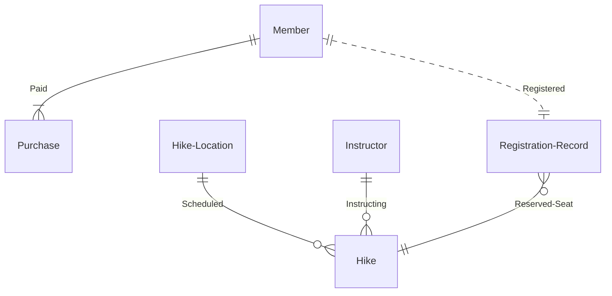

# Project Relations

In this diagram, the relationships between entities could be described in further detail:

+ Each member must have a purchase record since their first purchase occurs during registration.

+ Members may or may not have registered in a hike before.

+ Members may not have concurrent bookings.

+ Every hike must be instructed by an employee.

+ Each hike contains a trip to one destination only.