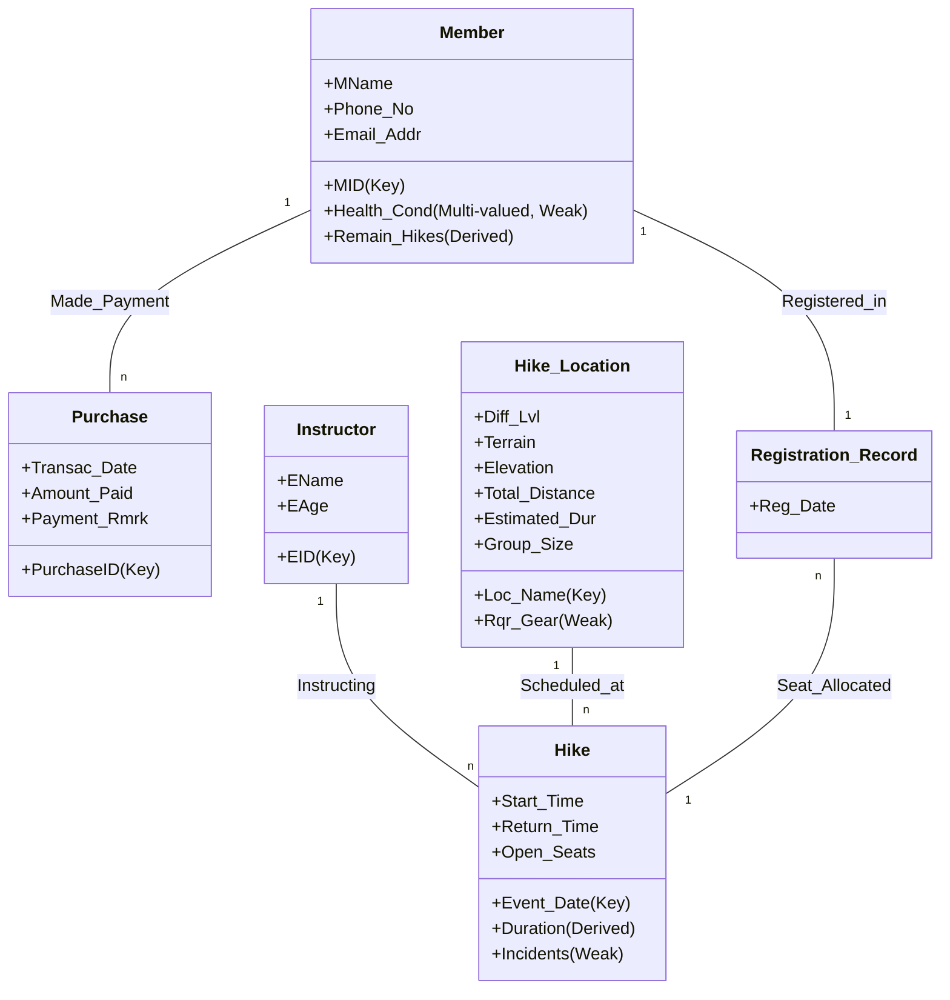
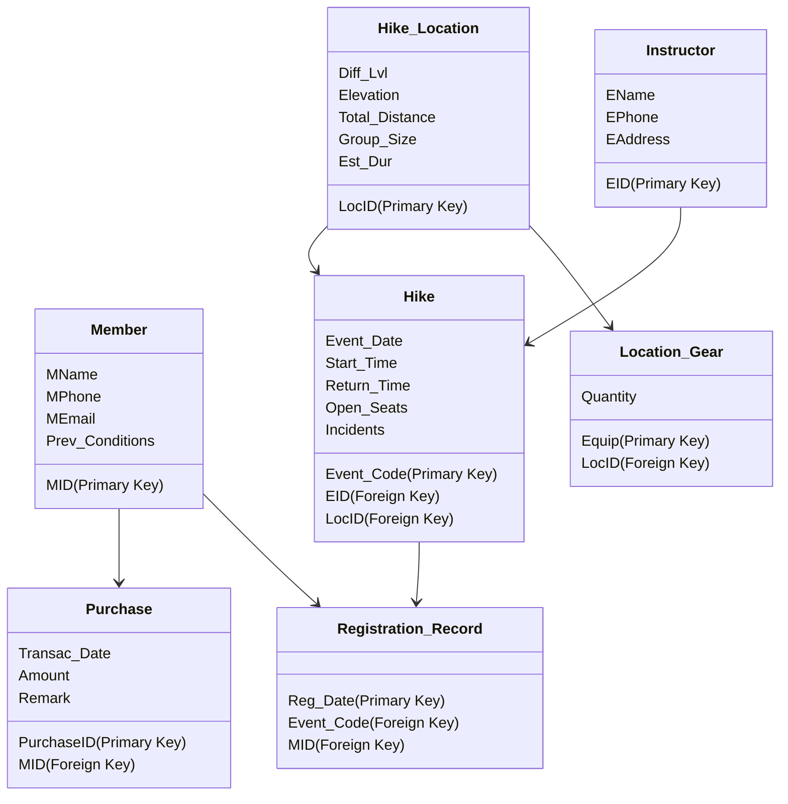

# Project Schema

+ Name of relations

+ All Attributes in the relation

+ Primary keys

+ Foreign keys

---

Member (<ins>MID</ins>, MName, Phone_No, Email_Addr)
Health_Condition (MID, Condition)

Hike (<ins>Event_Date</ins>, <ins>EID</ins>, Start_Time, Return_Time, Open_Seats)
Hike_Incidents (<ins>HikeID</ins>, <ins>MID</ins>, Incident)
Hike_Locations (<ins>LocID</ins>, Diff_Lvl, Terrain, Elevation, Total_Distance, Group_Size, Est_Dur)
Location_Gear(<ins>HikeID</ins>, <ins>EquipID</ins>, Quantity)

Registration_Record (<ins>Reg_Date</ins>, <ins>EventID</ins>, <ins>MID</ins>)

Instructor (<ins>EID</ins>, EName, EPhone, EAddress)

Purchase (<ins>Purchase_ID</ins>, Transac_Date, Amount, Remark)

---

## Revision of entities

